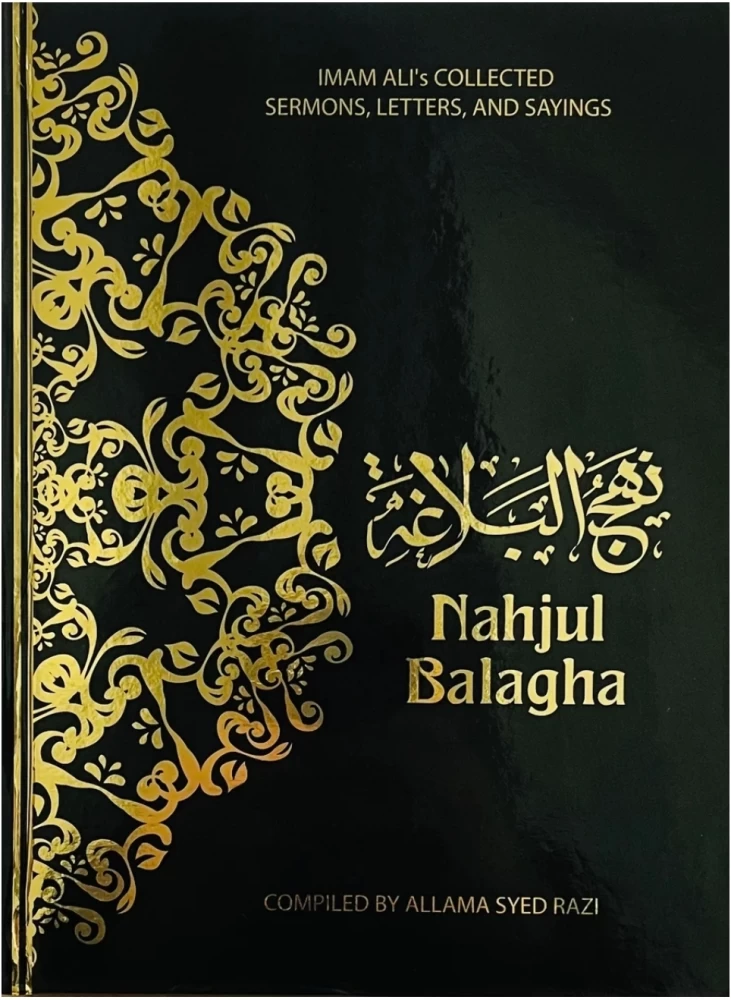

> [!CAUTION]
>
> I am trying to translate in my own way what the priest is saying in the recorded meetings. It is just me hoping to help others see a different side of Shia. And this translation is not a professional translation and it is completely how I am trying to communicate ideas. So no credibility in what is written here. Just a starting point for those who wants to learn more.

# Intro

You can find the introductory explanation in the [intro.md](./intro.md) file. It contains a very quick run over why we are doing this.

# Speeches

# Letters

# Aphorisms or Quotes
